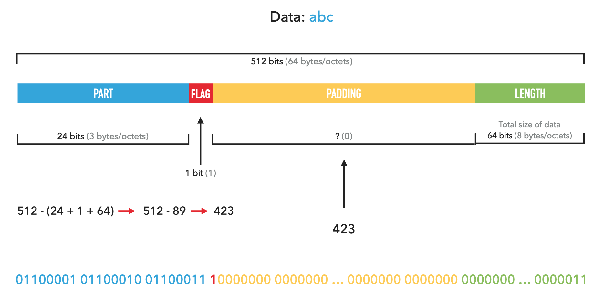
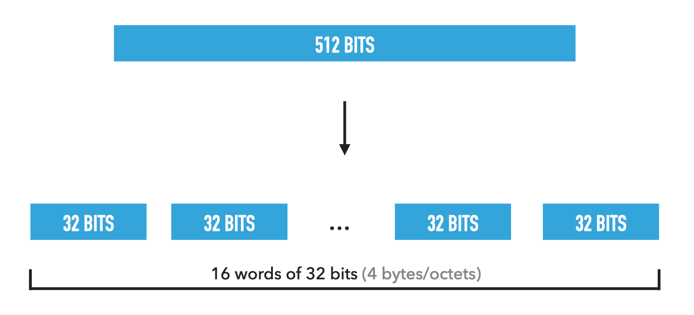

##  Contribution

You can contribute to the improvement of the documentation, by adding, modifying or deleting items.


## Definition

[SHA-256](https://en.wikipedia.org/wiki/SHA-2#Pseudocode) is a hash algorithm which is part of the [SHA-2](ttps://en.wikipedia.org/wiki/SHA-2) family which includes SHA-224, SHA-256, SHA-384 and SHA-512.


SHA-2 meaning **Secure Hash Algorithm 2**


- A [hash function](https://en.wikipedia.org/wiki/Hash_function) is a function that creates a fixed-size digital fingerprint of any data.
- The SHA-256 returns a 256-bit digital fingerprint or hash. (32 bytes)
- The hash can be used to obfuscate passwords or to check the integrity of data.


## Features

The algorithm handles blocks of 512 bits/64 bytes, if a block does not have this size (like the end of a message or the message is not long enough), then a padding will be done on the block to make it reach the size of 512 bits/64 bytes.


## Processing

#### 1. Initializations

We initialize 8 variables that contain each part of the hash.

These variables will be altered frequently, to increase the entropy.

```
State1 = 0x6a09e667
State2 = 0xbb67ae85
State3 = 0x3c6ef372
State4 = 0xa54ff53a
State5 = 0x510e527f
State6 = 0x9b05688c
State7 = 0x1f83d9ab
State8 = 0x5be0cd19
```

We initialize an array that will contain 64 constant values of 32 bits/4 bytes.

```
K = [
  0x428a2f98 0x71374491 0xb5c0fbcf 0xe9b5dba5 0x3956c25b 0x59f111f1 0x923f82a4 0xab1c5ed5
  0xd807aa98 0x12835b01 0x243185be 0x550c7dc3 0x72be5d74 0x80deb1fe 0x9bdc06a7 0xc19bf174
  0xe49b69c1 0xefbe4786 0x0fc19dc6 0x240ca1cc 0x2de92c6f 0x4a7484aa 0x5cb0a9dc 0x76f988da
  0x983e5152 0xa831c66d 0xb00327c8 0xbf597fc7 0xc6e00bf3 0xd5a79147 0x06ca6351 0x14292967
  0x27b70a85 0x2e1b2138 0x4d2c6dfc 0x53380d13 0x650a7354 0x766a0abb 0x81c2c92e 0x92722c85
  0xa2bfe8a1 0xa81a664b 0xc24b8b70 0xc76c51a3 0xd192e819 0xd6990624 0xf40e3585 0x106aa070
  0x19a4c116 0x1e376c08 0x2748774c 0x34b0bcb5 0x391c0cb3 0x4ed8aa4a 0x5b9cca4f 0x682e6ff3
  0x748f82ee 0x78a5636f 0x84c87814 0x8cc70208 0x90befffa 0xa4506ceb 0xbef9a3f7 0xc67178f2
]
```

During the hashing, the logical functions will be used.

Each of these functions takes 32 bits/4 bytes values as parameters and returns a 32 bits/4 bytes value.


ROTR = Rotation to the right  
SHR = Shift to the right  

& = binary operation `AND`  
∨ = binary operation `OR`  
⊕ = binary operation `XOR`  
¬ = binary operation `NOT` ([Ones' complement of binary number](https://en.wikipedia.org/wiki/Ones%27_complement))  


```
Ch(x, y, z) = (x & y) ⊕ (¬x & z)
Maj(x, y, z) = (x & y) ⊕ (x & z) ⊕ (y & z)
Σ0(x) = ROTR(x, 2) ⊕ ROTR(x, 13) ⊕ ROTR(x, 22)
Σ1(x) = ROTR(x, 6) ⊕ ROTR(x, 11) ⊕ ROTR(x, 25)
σ0(x) = ROTR(x, 7) ⊕ ROTR(x, 18) ⊕ SHR(x, 3)
σ1(x) = ROTR(x, 17) ⊕ ROTR(x, 19) ⊕ SHR(x, 10)
```


#### 2. Padding

The padding is done in three stages:

* We insert a bit at 1 after the message.
* Then we fill in bit 0, leaving 64bits/8 bytes at the end.
* Finally, we insert the size of the message in the remaining 64 bits/8 bytes.


"abc" (Message) `01100001 01100010 01100011`  
3 (Length of message) `00000000 00000000 00000000 00000000 00000000 00000000 00000000 00000011`  
(bit flag) `1`  
(the padding == 423 bits) `00000000...00000000`  


Simple representation: `abc 1 0000000000...000000000000 3`  
Binary representation: `01100001 01100010 01100011 10000000 0000000 … 0000000 0000000 0000000 … 0000011`




#### 3. Cutting into words

Each block of 512 bits/64 bytes is split into smaller blocks called "words".

Each `word` is 32 bits/4 bytes.



#### 4. Creating the word table

An array of 64 32 bits/4 bytes blocks is created.

`W[64]`

We insert the 16 words of the data in the first 16 blocks.

```
From 0 to 15: index
	W[index] = data[index]
```

Then from 16 to 64, the previous words are used to create new ones.

The logical functions `σ0` (sigma0) and `σ1` (sigma1) are used.

```
From 16 to 48: index
	W[index] = W[index - 16] + σ0(W[index - 15]) + W[index - 7] + σ1(W[index - 2])
```


#### 5. Calculation of the condensate

We start by initializing variables that will take the values of the `State`.

```
a = State1
b = State2
c = State3
d = State4
e = State5
f = State6
g = State7
h = State8
```


Then we do a 64-round loop.

t1 and t2 are temporary variables.

```
From 0 to 64: index
  t1 = h + ∑1(e) + Ch(e, f, g) + K[index] + W[index]
  t2 = ∑0(a) + Maj(a, b, c)
  h = g
  g = f
  f = e
  e = d + t1
  d = c
  c = b
  b = a
  a = t1 + t2
```


And finally, we add the value of the variables on `State`.

```
State1 = State1 + a
State2 = State2 + b
State3 = State3 + c
State4 = State4 + d
State5 = State5 + e
State6 = State6 + f
State7 = State7 + g
State8 = State8 + h
```


#### 6. Concatenation of values

When all the data is passed, we concatenate the `State` values to form the hash.


