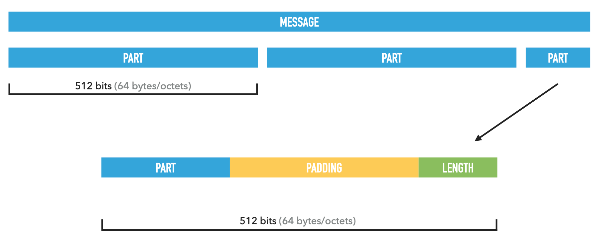
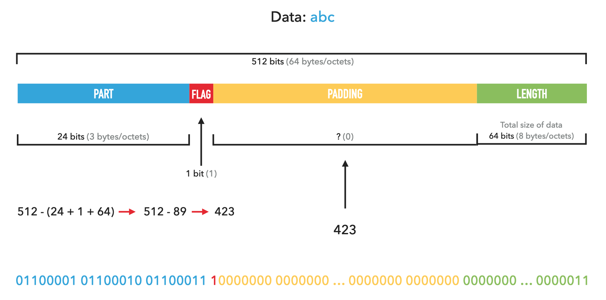
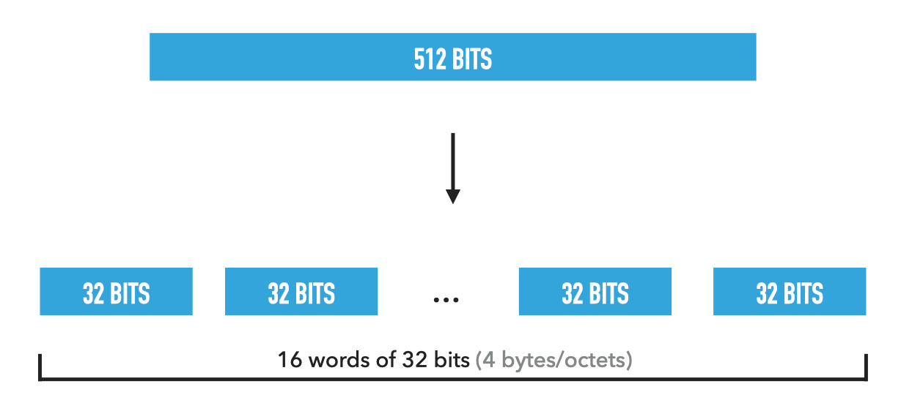
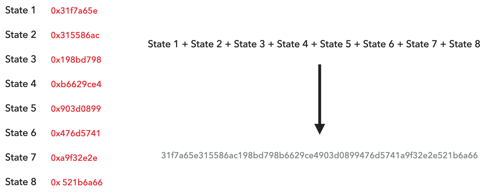

##  Contribution

Vous pouvez contribuer à l'amélioration de la documentation, en ajoutant, modifiant ou supprimant des éléments.


## Définition

[SHA-256](https://fr.wikipedia.org/wiki/SHA-2#SHA-256) est un algorithme de hachage qui fait partie de la famille des [SHA-2](https://fr.wikipedia.org/wiki/SHA-2) qui comprend SHA-224, SHA-256, SHA-384 et SHA-512.


SHA-2 signifie **Secure Hash Algorithm 2**


- Une [fonction de hachage](https://fr.wikipedia.org/wiki/Fonction_de_hachage) est une fonction qui crée une empreinte numérique à taille fixe de n’importe quelle donnée.
- Le SHA-256 retourne une empreinte numérique ou hash de 256 bits. (32 bytes/octets)
- Le hachage peut servir pour obfusqué les mots de passe ou pour vérifier l’intégrité d’une donnée.


## Fonctionnalités

L'algorithme traite des blocs de 512 bits/64 octets, si un bloc n'a pas cette taille (comme la fin d'un message ou le message n'est pas assez long), alors un padding sera fait sur le bloc pour qu'il atteigne la taille de 512 bits/64 octets.




## Fonctionnement

#### 1. Initialisations

On initialise 8 variables qui contient chaque partie du hash.

Ces variables vont être altéré fréquemment, pour augmenter l'entropie.

```
State1 = 0x6a09e667
State2 = 0xbb67ae85
State3 = 0x3c6ef372
State4 = 0xa54ff53a
State5 = 0x510e527f
State6 = 0x9b05688c
State7 = 0x1f83d9ab
State8 = 0x5be0cd19
```

On initialise un tableau qui contiendra 64 valeurs constantes 32bits/4octets.

```
K = [
  0x428a2f98 0x71374491 0xb5c0fbcf 0xe9b5dba5 0x3956c25b 0x59f111f1 0x923f82a4 0xab1c5ed5
  0xd807aa98 0x12835b01 0x243185be 0x550c7dc3 0x72be5d74 0x80deb1fe 0x9bdc06a7 0xc19bf174
  0xe49b69c1 0xefbe4786 0x0fc19dc6 0x240ca1cc 0x2de92c6f 0x4a7484aa 0x5cb0a9dc 0x76f988da
  0x983e5152 0xa831c66d 0xb00327c8 0xbf597fc7 0xc6e00bf3 0xd5a79147 0x06ca6351 0x14292967
  0x27b70a85 0x2e1b2138 0x4d2c6dfc 0x53380d13 0x650a7354 0x766a0abb 0x81c2c92e 0x92722c85
  0xa2bfe8a1 0xa81a664b 0xc24b8b70 0xc76c51a3 0xd192e819 0xd6990624 0xf40e3585 0x106aa070
  0x19a4c116 0x1e376c08 0x2748774c 0x34b0bcb5 0x391c0cb3 0x4ed8aa4a 0x5b9cca4f 0x682e6ff3
  0x748f82ee 0x78a5636f 0x84c87814 0x8cc70208 0x90befffa 0xa4506ceb 0xbef9a3f7 0xc67178f2
]
```

Pendant le hachage, des fonctions logiques seront utilisées.

Chacun de ces fonctions prend en paramètre des valeurs de 32bits/4octets et retourne une valeur de 32bits/4octets.


ROTR = Rotation sur la droite  
SHR = Décalage sur la droite  

& = opération binaire `AND`  
∨ = opération binaire `OR`  
⊕ = opération binaire `XOR`  
¬ = opération binaire `NOT` ([Le complément à un d'un nombre binaire](https://fr.wikipedia.org/wiki/Compl%C3%A9ment_%C3%A0_un))  


```
Ch(x, y, z) = (x & y) ⊕ (¬x & z)
Maj(x, y, z) = (x & y) ⊕ (x & z) ⊕ (y & z)
Σ0(x) = ROTR(x, 2) ⊕ ROTR(x, 13) ⊕ ROTR(x, 22)
Σ1(x) = ROTR(x, 6) ⊕ ROTR(x, 11) ⊕ ROTR(x, 25)
σ0(x) = ROTR(x, 7) ⊕ ROTR(x, 18) ⊕ SHR(x, 3)
σ1(x) = ROTR(x, 17) ⊕ ROTR(x, 19) ⊕ SHR(x, 10)
```


#### 2. Padding

Le padding se fait en trois étape:

* On insère un bit à 1 après le message
* Puis on rempli de bit 0, en laissant 64bits/8octets à la fin
* Finalement, on insère la taille du message dans les 64bits/8octets restant


"abc" (Message) `01100001 01100010 01100011`  
3 (Taille du message) `00000000 00000000 00000000 00000000 00000000 00000000 00000000 00000011`  
(Le bit de flag) `1`  
(Le padding == 423 bits) `00000000...00000000`  


Représentation simple: `abc 1 0000000000...000000000000 3`  
Représentation binaire: `01100001 01100010 01100011 10000000 0000000 … 0000000 0000000 0000000 … 0000011`




#### 3. Découpage en mots

Chaque blocs de 512 bits/64 octets est découpé en plus petit bloc appelé des `mots`.

Chaque `mots` fait 32bits/4octets.



#### 4. Création du tableau de mots

On crée un tableau de 64 blocs de 32bits/4octets.

`W[64]`

On insère les 16 mots de la données dans les 16 premiers blocs.

```
De 0 à 15: index
	W[index] = data[index]
```

Ensuite de 16 à 64, on se sert des mots précèdent insère pour en créer de nouveaux.

Les fonctions logiques `σ0` (sigma0) et `σ1` (sigma1) sont utilisées.

```
De 16 à 48: index
	W[index] = W[index - 16] + σ0(W[index - 15]) + W[index - 7] + σ1(W[index - 2])
```


#### 5. Calcul du condensé

On commence par initialiser des variables qui prendront les valeurs du `State`

```
a = State1
b = State2
c = State3
d = State4
e = State5
f = State6
g = State7
h = State8
```


Ensuite, on fait une boucle de 64 tours.

t1 et t2 sont des variables temporaire

```
De 0 à 64: index
  t1 = h + ∑1(e) + Ch(e, f, g) + K[index] + W[index]
  t2 = ∑0(a) + Maj(a, b, c)
  h = g
  g = f
  f = e
  e = d + t1
  d = c
  c = b
  b = a
  a = t1 + t2
```


Et pour finir, on ajoute la valeur des variables on `State`

```
State1 = State1 + a
State2 = State2 + b
State3 = State3 + c
State4 = State4 + d
State5 = State5 + e
State6 = State6 + f
State7 = State7 + g
State8 = State8 + h
```


#### 6. Concaténation des valeurs

Quand toutes la données est passée, on concatène les valeurs du `State` pour former le hash.


